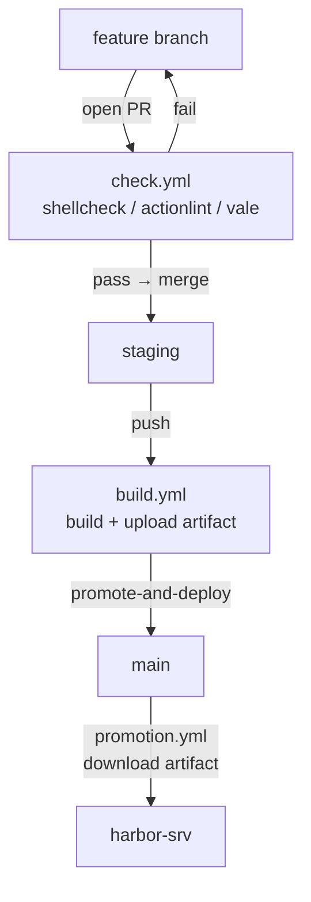

# harbor_srv

[](https://github.com/JCBlouin/harbor_srv/actions/workflows/check.yml)
[](https://github.com/JCBlouin/harbor_srv/actions/workflows/build.yml)
[](https://github.com/JCBlouin/harbor_srv/compare/main...staging)

A bare-minimum, stateless Arch Linux server for hosting Docker containers on a Lenovo ThinkPad connected to a Synology NAS.

The core idea: the OS is a disposable, reproducible artifact. When something goes wrong, you reflash—you don't troubleshoot. The project handles upgrades the same way as deployments.

## Table of contents

- [Architecture](#architecture)
  - [Zero-drift guarantee](#zero-drift-guarantee)
  - [A/B boot with automatic fallback](#ab-boot-with-automatic-fallback)
- [Hardware](#hardware)
- [Repository layout](#repository-layout)
- [Getting started](#getting-started)
  - [First-time setup](#first-time-setup)
  - [Deploying an update](#deploying-an-update)
  - [SSH access](#ssh-access)
- [Making changes](#making-changes)
  - [Branch workflow](#branch-workflow)
- [Updating the stack](#updating-the-stack)

## Architecture

CI builds a root filesystem image from a package list and a configuration overlay. CI writes that image directly to one of two NVMe partitions (A/B layout). The bootloader automatically falls back to the previous partition if the new one fails to boot.

```
GitHub Actions
  └── pacstrap + profile/airootfs overlay
      └── harbor_srv-root.img.zst  (artifact)
            │
            ▼
      scripts/install.sh           (one-time, partitions NVMe)
      scripts/deploy.sh            (every release, writes to inactive slot)
            │
            ▼
      NVMe (476GB)
        nvme0n1p1   512MB   ESP (FAT32, systemd-boot)
        nvme0n1p2   10GB    Root A  (ext4)
        nvme0n1p3   10GB    Root B  (ext4)
        nvme0n1p4   ~456GB  Data    (ext4, /data)
            │
            ▼
      Synology NAS (192.168.1.10)
        /volume1/harbor_srv  →  /mnt/synology/harbor_srv
          docker/            →  Docker Compose stacks
```

### Zero-drift guarantee

Nothing on the root filesystem persists across deploys. Each deployment replaces the entire root. Persistent state lives on the NFS share (Docker volumes, compose files) or the `/data` partition.

### A/B boot with automatic fallback

Each deploy writes a new image to the inactive root partition with a systemd-boot try-counter (`+3`). If the system fails to boot 3 times, systemd-boot automatically falls back to the other partition. On successful boot, `systemd-bless-boot.service` marks the entry as good.

## Hardware

| Component | Detail |
|-----------|--------|
| Machine | Lenovo ThinkPad (host name: `harbor-srv`) |
| IP | 192.168.1.5 (static) |
| NVMe | 476GB |
| NAS | Synology at 192.168.1.10 |

## Repository layout

```
profile/                  OS profile — everything baked into the root image
  airootfs/               Config overlay, copied verbatim into the root
  packages.x86_64         Package list installed via pacstrap
  pacman.conf             pacman config used during build
  profiledef.sh           File permission overrides applied after overlay copy

scripts/
  build-image.sh          CI: builds the root filesystem image via pacstrap
  install.sh              One-time: partitions NVMe and writes first image
  deploy.sh               Each release: writes image to inactive slot, reboots

.github/workflows/
  check.yml               Runs on PR to staging: shellcheck, actionlint, vale. Fast gate — no build.
  build.yml               Runs on push to staging: build image + upload artifact (named with commit SHA).
  select-runner.yml       Reusable runner selection: wsl-docker-runner → harbor-srv-docker → ubuntu-latest.
  promotion.yml           Manual dispatch with action dropdown: promote-and-deploy / promote / deploy.
  compose-manage.yml      Manual dispatch: rescan, update, stop, start containers on harbor-srv.
```

## Getting started

### First-time setup

1. Boot a live Arch ISO from USB on the ThinkPad
2. Download the latest `harbor_srv-root` artifact from GitHub Actions
3. Run the installer:

```bash
curl -O https://raw.githubusercontent.com/JCBlouin/harbor_srv/main/scripts/install.sh
bash install.sh /dev/nvme0n1 harbor_srv-root.img.zst
```

4. Reboot—disable Secure Boot in UEFI first (unsigned bootloader)

### Deploying an update

Triggered manually from **Actions → Promotion → Run workflow**. Select an action from the dropdown:

**promote-and-deploy** (default, most common)—promotes `staging` to `main` and immediately deploys to the server. Type `ok reboot` to confirm. The server will reboot. No image rebuild—the promote workflow downloads and flashes the artifact already uploaded by `build.yml` on `staging`.

**promote**: fast-forwards `main` to `staging` without deploying. No confirmation required.

**deploy**: flashes the server without promoting. Type `ok reboot` to confirm.

All actions verify that `build.yml` is green on `staging` before touching `main`.

### Server access

```bash
ssh -i ~/.ssh/harbor_srv root@192.168.1.5
```

## Making changes

All OS configuration lives in `profile/`. To add a package, add it to `profile/packages.x86_64`. To add or change a configuration file, add it under `profile/airootfs/` at the path it should appear on the root filesystem.

Commit messages follow [Conventional Commits](https://www.conventionalcommits.org) (`feat:`, `fix:`, `docs:`, `chore:`, etc.).

See [`profile/README.md`](profile/README.md) and [`scripts/README.md`](scripts/README.md) for details.

### Branch workflow



**Day-to-day:**

1. **Branch from `staging`:**
   ```bash
   git checkout staging && git pull
   git checkout -b feat/your-change
   ```
2. **Open a PR targeting `staging`**: `check.yml` runs `shellcheck`, `actionlint`, and vale (no build).
3. **Rebase and merge** into `staging` (no merge commits): `build.yml` builds the image and uploads the artifact.
4. **Promote when ready**: go to **Actions → Promotion → Run workflow** and select an action:
   - **promote-and-deploy**: promotes and immediately flashes the server, type `ok reboot`.
   - **promote**: fast-forwards `staging` → `main`, no deploy.

> `staging` and `main` are always at the same commit after a promotion—divergence is structurally impossible with fast-forward-only merges.

## Updating the stack

The build pins all package versions and the build environment to a snapshot date. To upgrade to a newer point in time, edit **`.github/workflows/build.yml`** and **`.github/workflows/check.yml`**: two adjacent values in each:

1. Update `ARCH_SNAPSHOT` to the new date (`YYYY/MM/DD`). Check [archive.archlinux.org/repos](https://archive.archlinux.org/repos/) to confirm the date is available.
2. Update the `container.image` digest to match. Fetch it with:

```bash
docker manifest inspect --verbose archlinux/archlinux:latest \
  | grep -m1 '"digest"' | awk -F'"' '{print $4}'
```

3. Open a PR—CI builds the new image for review before it reaches the server.
